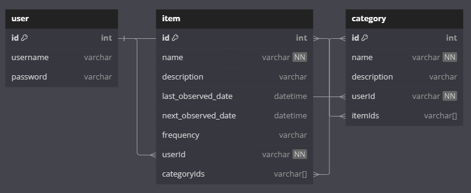

# Routine Tracker

by Jason Fox

## Project Requirements

## Tech Stack
- C# 
- ASP.NET Core
- SQL Server (locally hosted)
- XUnit for testing

## Tables

## MVP Goals
- Users can be created
- Users can create and manage routine items
- Users can set a name and description for routine items
- Users can set a last and next observed date for items
- Users can create and manage categories (items are uncategorized by default)
- Users can assign and unassign items to categories

